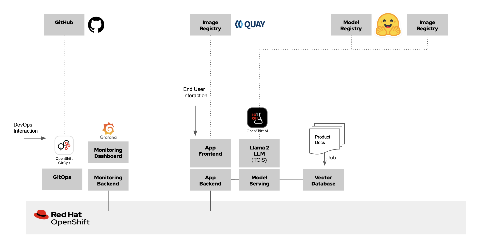
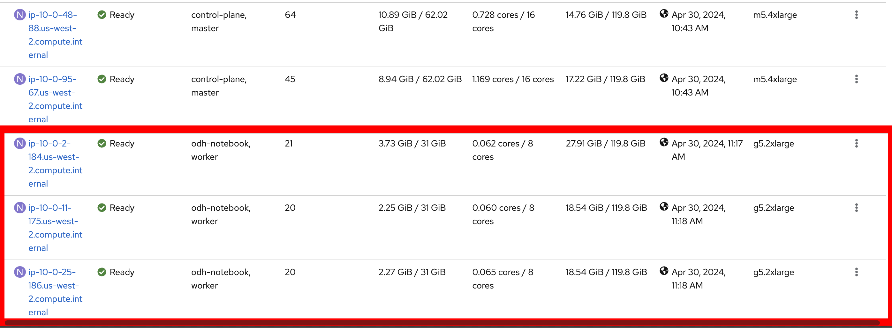

# Document Generation Demo with LLM and RAG

## Introduction

This deployment is based on the `validated pattern framework`, using GitOps for
seamless provisioning of all operators and applications. It deploys a Chatbot
application that harnesses the power of Large Language Models (LLMs) combined
with the Retrieval-Augmented Generation (RAG) framework.

The application uses either the [EDB Postgres for Kubernetes operator](https://catalog.redhat.com/software/container-stacks/detail/5fb41c88abd2a6f7dbe1b37b)
(default) or Redis to store embeddings of Red Hat products, running on Red Hat
OpenShift to generate project proposals for specific Red Hat products.

## Pre-requisites

- Podman
- Red Hat Openshift cluster running in AWS. Supported regions are us-west-2 and us-east-1.
- GPU Node to run Hugging Face Text Generation Inference server on Red Hat OpenShift cluster.
- Create a fork of the [rag-llm-gitops](https://github.com/validatedpatterns/rag-llm-gitops.git) git repository.

## Demo Description & Architecture

The goal of this demo is to demonstrate a Chatbot LLM application augmented with data from Red Hat product documentation
running on Red Hat OpenShift. It deploys an LLM application that connects to multiple LLM providers such as OpenAI, Hugging Face, and NVIDIA NIM.
The application generates a project proposal for a Red Hat product

### Key Features

- LLM Application augmented with content from Red Hat product documentation.
- Multiple LLM providers (OpenAI, Hugging Face, NVIDIA)
- Vector Database, such as EDB Postgres for Kubernetes or Redis, to store embeddings of RedHat product documentation.
- Monitoring dashboard to provide key metrics such as ratings
- GitOps setup to deploy e2e demo (frontend / vector database / served models)


_Figure 1. Overview of the validated pattern for RAG Demo with Red Hat OpenShift_


_Figure 2. Logical diagram of the RAG Demo with Red Hat OpenShift._


#### RAG Demo Workflow


_Figure 3. Schematic diagram for workflow of RAG demo with Red Hat OpenShift._


#### RAG Data Ingestion


_Figure 4. Schematic diagram for Ingestion of data for RAG._


#### RAG Augmented Query


_Figure 5. Schematic diagram for RAG demo augmented query._


In Figure 5, we can see RAG augmented query. Llama 2 model is used for for language processing, LangChain to
integrate different tools of the LLM-based application together and to process the PDF
files and web pages, vector database provider such as EDB Postgres for Kubernetes or Redis, is used to store vectors, HuggingFace TGI
is used to serve the Llama 2 model, Gradio is used for user interface and object storage to store language model and other datasets.
Solution components are deployed as microservices in the Red Hat OpenShift cluster.


#### Download diagrams
View and download all of the diagrams above in our open source tooling site.

[Open Diagrams](https://www.redhat.com/architect/portfolio/tool/index.html?#gitlab.com/osspa/portfolio-architecture-examples/-/raw/main/diagrams/rag-demo-vp.drawio)



_Figure 6. Proposed demo architecture with OpenShift AI_

### Components deployed

- **Hugging Face Text Generation Inference Server:** The pattern deploys a Hugging Face TGIS server. The server deploys `mistral-community/Mistral-7B-v0.2` model. The server will require a GPU node.
- **EDB Postgres for Kubernetes / Redis Server:** A Vector Database server is deployed to store vector embeddings created from Red Hat product documentation.
- **Populate VectorDb Job:** The job creates the embeddings and populates the vector database.
- **LLM Application:** This is a Chatbot application that can generate a project proposal by augmenting the LLM with the Red Hat product documentation stored in vector db.
- **Prometheus:** Deploys a prometheus instance to store the various metrics from the LLM application and TGIS server.
- **Grafana:** Deploys Grafana application to visualize the metrics.

## Deploying the demo

### Cloning repository

```sh
git clone https://github.com/<<your-username>>/rag-llm-gitops.git
cd rag-llm-gitops
oc login --token=<> --server=<> # login to Openshift cluster
podman machine start
# Copy values-secret.yaml.template to ~/values-secret-rag-llm-gitops.yaml.
# You should never check-in these files
# Add secrets to the values-secret.yaml that needs to be added to the vault.
cp values-secret.yaml.template ~/values-secret-rag-llm-gitops.yaml
```

### Provision GPU MachineSet

As a pre-requisite to deploy the application using the validated pattern, GPU nodes should be provisioned along with Node Feature Discovery Operator and NVIDIA GPU operator. To provision GPU Nodes

Following command will take about 5-10 minutes.

```sh
./pattern.sh make create-gpu-machineset
```

Wait till the nodes are provisioned and running.



Alternatiely, follow the [instructions](./GPU_provisioning.md) to manually install GPU nodes, Node Feature Discovery Operator and NVIDIA GPU operator.

### Deploy application

***Note:**: This pattern supports two types of vector databases, EDB Postgres for Kubernetes and Redis. By default the pattern will deploy EDB Postgres for Kubernetes as a vector DB. To deploy Redis, change the global.db.type to REDIS in [values-global.yaml](./values-global.yaml).

```yaml
---
global:
  pattern: rag-llm-gitops
  options:
    useCSV: false
    syncPolicy: Automatic
    installPlanApproval: Automatic
# Possible value for db.type = [REDIS, PGVECTOR]
  db:
    index: docs
    type: PGVECTOR  <--- Default is PGVECTOR, Change the db type to REDIS for Redis deployment
main:
  clusterGroupName: hub
  multiSourceConfig:
    enabled: true
```

Following commands will take about 15-20 minutes

> **Validated pattern will be deployed**

```sh
./pattern.sh make install
```

### 1: Verify the installation

- Login to the OpenShift web console.
- Navigate to the Workloads --> Pods.
- Select the `rag-llm` project from the drop down.
- Following pods should be up and running.


Note: If the hf-text-generation-server is not running, make sure you have followed the steps to configure a node with GPU from the [instructions](./GPU_provisioning.md) provided above.

### 2: Launch the application

- Click the `Application box` icon in the header, and select `Retrieval-Augmented-Generation (RAG) LLM Demonstration UI`


- It should launch the application

  

### 3: Generate the proposal document

- It will use the default provider and model configured as part of the application deployment. The default provider is a Hugging Face model server running in the OpenShift. The model server is deployed with this valdiated pattern and requires a node with GPU.
- Enter any company name
- Enter the product as `RedHat OpenShift`
- Click the `Generate` button, a project proposal should be generated. The project proposal also contains the reference of the RAG content. The project proposal document can be Downloaded in the form of a PDF document.

  

### 4: Add an OpenAI provider

You can optionally add additional providers. The application supports the following providers

- Hugging Face Text Generation Inference Server
- OpenAI
- NVIDIA

Click on the `Add Provider` tab to add a new provider. Fill in the details and click `Add Provider` button. The provider should be added in the `Providers` dropdown uder `Chatbot` tab.


### 5: Generate the proposal document using OpenAI provider

Follow the instructions in step 3 to generate the proposal document using the OpenAI provider.


### 6: Rating the provider

You can provide rating to the model by clicking on the `Rate the model` radio button. The rating will be captured as part of the metrics and can help the company which model to deploy in prodcution.

### 7: Grafana Dashboard

By default, Grafana application is deployed in `llm-monitoring` namespace.To launch the Grafana Dashboard, follow the instructions below:

- Grab the credentials of Grafana Application
  - Navigate to Workloads --> Secrets
  - Click on the grafana-admin-credentials and copy the GF_SECURITY_ADMIN_USER, GF_SECURITY_ADMIN_PASSWORD
- Launch Grafana Dashboard
  - Click the `Application box` icon in the header, and select `Grafana UI for LLM ratings`
 
  - Enter the Grafana admin credentials.
  - Ratings are displayed for each model.


## Test Plan
GOTO: [Test Plan](./TESTPLAN.md)

## Licenses

EDB Postgres for Kubernetes is distributed under the EDB Limited Usage License
Agreement, available at [enterprisedb.com/limited-use-license](https://www.enterprisedb.com/limited-use-license).

